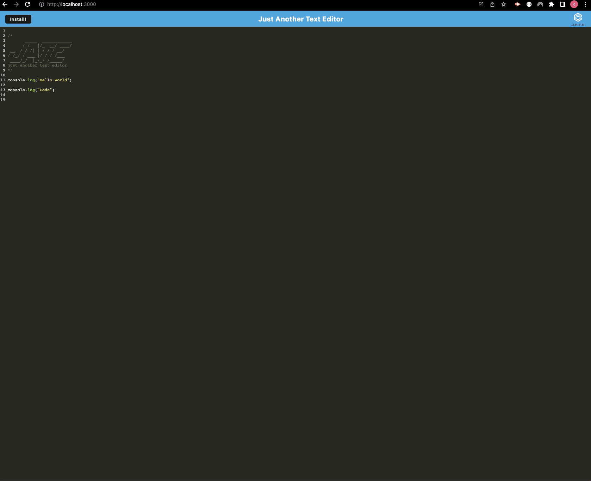

# Text-Week-19-Challenge

Module 19 Challenge
## Description

Creating a daily planner/scheduler application where users can save any information to jot down their scheduled activities on their designated timeframe. 
## Link

<https://kenjib32.github.io/Text-Week-19-Challenge/>
## Screenshot

## Complied Criteria

* Application will execute once npm run start is entered.

* There is a generated HTML file and manifest file after running the code.

* Functional text editor without errors.

* IndexedDB creates a database storage.

* After reopening the text editor, saved data is retrieved from the IndexedDB.

* Properly loading application.

## Repository

<https://github.com/Kenjib32/Text-Week-19-Challenge>